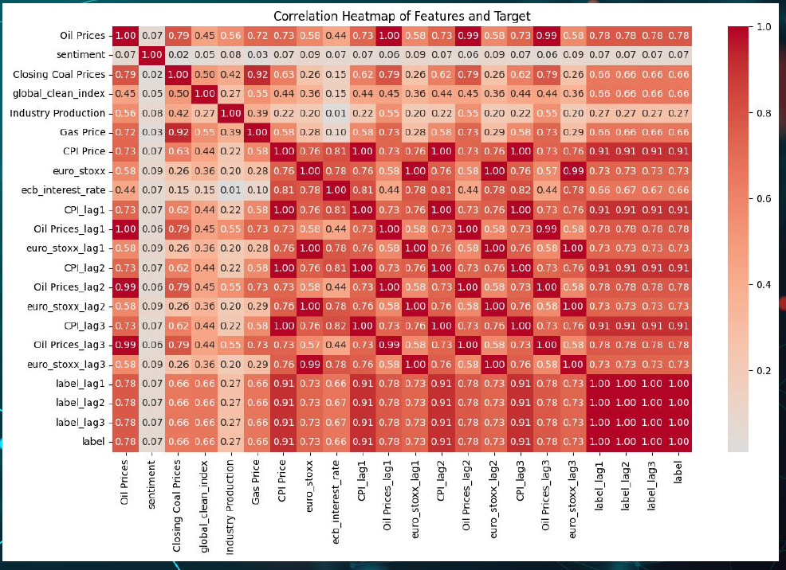
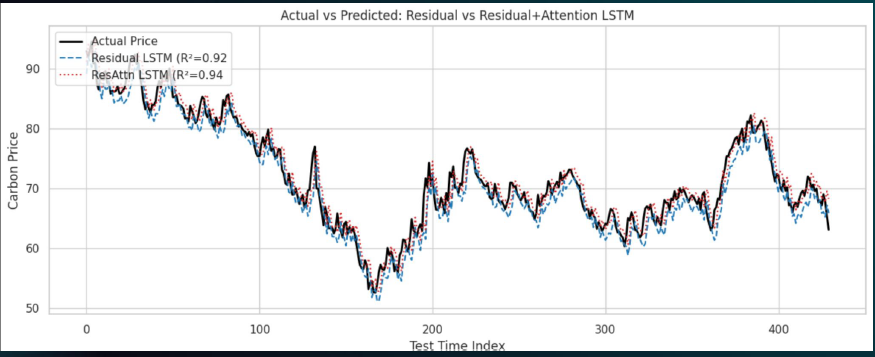

# 🌍 Carbon Price Predictor

A machine learning project predicting **European carbon emission futures (EUR)** using **structured data** (energy, macro, finance) and **unstructured data** (news sentiment).  
Built with a focus on **interpretability, accessibility, and real-world deployment** using only **freely available data**.

---

## 📌 Why it matters
Carbon markets are rapidly growing as part of the global push toward emission reductions. Accurate forecasts of carbon futures can:
- Help firms **hedge risks** in compliance markets
- Support **policy and sustainability teams** in planning
- Enable **resource-constrained institutions** to use ML without paid data sources

---

## 🛠️ Methodology
1. **Data Collection**
   - 10 years (2015–2025) of structured data: crude oil, coal, Euro Stoxx 50, etc.
   - News scraped from *oilprice.com* processed via **MiniLM sentence embeddings** + **FinBERT sentiment analysis**.
   - Aligned daily frequency dataset created (`10md_sentiment.csv`).

2. **Feature Engineering**
   - Lag features, daily/monthly variants
   - Correlation and visualization analysis
   - Sentiment scores integrated with structured data

3. **Models**
   - **Baseline:** Random Forest Regressor  
   - **TabNet:** Deep tabular model (poor on noisy features)  
   - **Hybrid MLP + LSTM:** MLP for nonlinearity + LSTM for residual temporal patterns  
   - **Residual + Attention LSTM:** Best performing; skip-connection and attention on residuals

4. **Evaluation**
   - Metrics: RMSE, MAE, R²  
   - Walk-forward validation, chronological train/test splits





---

## 📊 Results
| Model                   | MSE    | RMSE  | MAE   | R²   |
|--------------------------|--------|-------|-------|------|
| Random Forest (baseline) | 12.25  | 3.50  | 2.821 | 0.873 |
| Hybrid MLP + LSTM        | 8.166  | 2.857 | 2.206 | 0.831 |
| Residual + Attention LSTM| **4.27** | **2.066** | **1.641** | **0.946** |
| TabNet                   | 410.3  | 20.25 | 16.14 | 2.266 |


👉 **Residual + Attention LSTM** achieved the strongest performance with **R² = 0.946**.



---

## 🚀 Quickstart
```bash
# Clone repo
git clone https://github.com/Renata1214/Adv_ML_Carbon_Predictor_Project.git
cd Adv_ML_Carbon_Predictor_Project

# Install dependencies
pip install -r requirements.txt

# Run training
python src/train.py --config configs/config.yaml

# Evaluate model
python src/evaluate.py --model residual_attention_lstm
